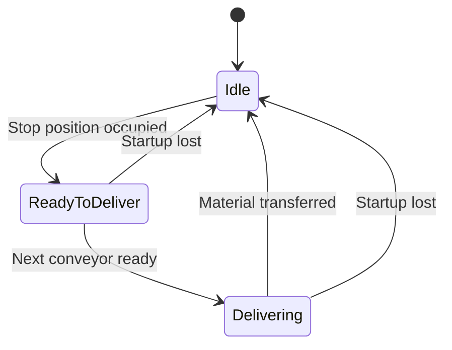
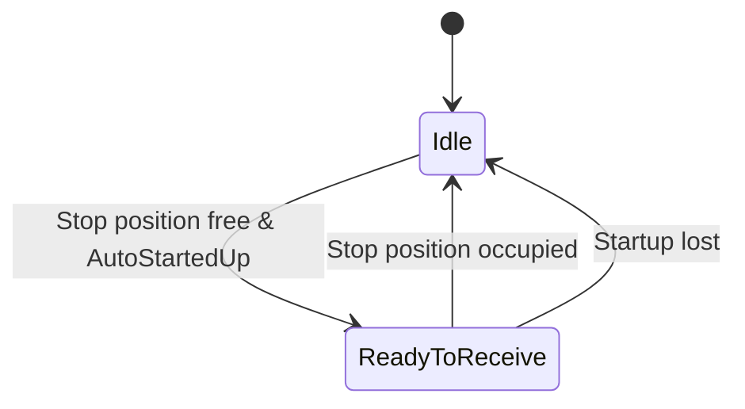

# Conveyor System Documentation

## Overview

The Conveyor system provides a comprehensive transport module implementation for uni-directional conveyors with material flow control, automatic startup, and coordinated transfer between adjacent conveyors.

## Architecture

The architecture diagram is already included in the [main README](../README.md#architecture). This document focuses on detailed functionality and method descriptions.

## Material Flow Concept

```
 ________  _________________________________________|_____  _______
   Prev  \/ Conveyor: Material flow: downward    -> |     \/ Next      
         || <- ReadyToReceive/ReadyToDeliver     -> |     ||
         ||                   Delivering -> |     ||
 ________/\_________________________________________|_____/\_______
                                            | 
                                       Stop Sensor
```

### States
- **ReadyToReceive** → Signals to upstream (previous) conveyor
- **ReadyToDeliver** → Signals to downstream (next) conveyor  
- **Delivering** → Active material transfer to next conveyor

---

## Components

### ConveyorBase Class

The [`ConveyorBase`](../src/Conveyor/ConveyorBase.st) is the main conveyor implementation that extends `EquipmentBase` and implements [`IConveyor`](../src/Conveyor/Interfaces/IConveyor.st).

#### Properties

| Property | Type | Default | Description |
|----------|------|---------|-------------|
| `Name` | STRING[30] | - | Conveyor identifier |
| `StopSensor` | IBinSignal | NULL | Stop position sensor (required) |
| `OffDelayTime` | TIME | T#5s | Motor off-delay time after transfer |
| `PrevConveyor` | IDeliverer | NULL | Reference to previous (upstream) conveyor |
| `NextConveyor` | IReceiver | NULL | Reference to next (downstream) conveyor |
| `Motor` | IMotor | NULL | Motor instance (uses NullMotor if not set) |
| `AutomaticSpeed` | LREAL | 1.5 m/s | Normal operating speed in automatic mode |
| `ManualSpeed` | LREAL | 0.5 m/s | Slow speed for manual mode operation |
| `Acceleration` | LREAL | 1.0 m/s² | Motor acceleration rate |
| `Deceleration` | LREAL | 1.0 m/s² | Motor deceleration rate |
| `SensorBlockedTime` | LTIME | T#5s | Timeout for sensor blocking detection |

#### Inherited Properties (from EquipmentBase)

| Property | Type | Description |
|----------|------|-------------|
| `Mode` | ItfOperatingMode | Operating mode (Manual/Automatic) |
| `ExternalRelease` | ItfRelease | External release signal |
| `ExternalAutoStartup` | ItfAutoStartup | External auto-startup control |
| `StartUpTime` | TIME | Startup warning time |

#### Methods

##### `InitUser()` (Protected Override)
Initializes the conveyor and all internal objects.

**Behavior:**
- Initializes ReadyToDeliver, ReadyToReceive, and StopPosition objects
- Validates that StopSensor is configured
- Applies Null Object Pattern for Motor (uses NullMotor if Motor is NULL)

**Configuration Error:**
Sets `ConfigError` if `StopSensor` is NULL.

##### `RunCyclicUserCode()` (Protected Override)
Cyclic execution method - must be called every PLC cycle.

**Behavior:**
1. Evaluates automatic release status
2. Updates stop position status
3. Evaluates deliver and receive states
4. Controls motor based on run conditions
5. Handles motor start/stop transitions

**Motor Control:**
- Starts motor when `MotorOnIsReleased()` returns TRUE
- Stops motor when conditions are no longer met
- Uses configured acceleration/deceleration parameters

##### `TriggerStartInAutomatic()`
Manually triggers conveyor start in automatic mode.

**Conditions:**
- Startup status must be `AutoStartedUp`
- Stop position must not be occupied

**Usage:**
```st
IF startButton THEN
    conveyor.TriggerStartInAutomatic();
END_IF;
```

##### `StartManual() : BOOL`
Starts the conveyor in manual mode.

**Returns:**
- `TRUE` - Start command accepted
- `FALSE` - Start command rejected

**Conditions:**
- Operating mode must be `Manual`
- External release must be active

**Usage:**
```st
IF conveyor.StartManual() THEN
    // Conveyor started successfully
END_IF;
```

##### `Stop()`
Stops the conveyor immediately.

**Behavior:**
- Clears manual start flag
- Motor will decelerate according to configured deceleration

**Usage:**
```st
IF stopButton THEN
    conveyor.Stop();
END_IF;
```

##### `DeliverStatus() : DeliverState`
Returns the current delivery state.

**Returns:**
- `DeliverState#Idle` - No material to deliver
- `DeliverState#ReadyToDeliver` - Material ready, waiting for receiver
- `DeliverState#Delivering` - Actively transferring material

**Usage:**
```st
IF conveyor.DeliverStatus() = DeliverState#ReadyToDeliver THEN
    // Material ready for transfer
END_IF;
```

##### `ReceiveStatus() : ReceiveState`
Returns the current receive state.

**Returns:**
- `ReceiveState#Idle` - Not ready to receive
- `ReceiveState#ReadyToReceive` - Ready to accept material

**Usage:**
```st
IF conveyor.ReceiveStatus() = ReceiveState#ReadyToReceive THEN
    // Conveyor can accept material
END_IF;
```

##### `IsOccupied() : BOOL`
Checks if the stop position is occupied.

**Returns:**
- `TRUE` - Material present at stop position
- `FALSE` - Stop position empty

**Usage:**
```st
IF conveyor.IsOccupied() THEN
    // Material detected
END_IF;
```

##### `Delivering() : BOOL`
Checks if a transfer is currently in progress.

**Returns:**
- `TRUE` - Transfer active
- `FALSE` - No transfer

**Usage:**
```st
IF conveyor.Delivering() THEN
    // Material being transferred
END_IF;
```

##### `IsMotorRunning() : BOOL`
Returns whether the motor is currently running.

**Returns:**
- `TRUE` - Motor is running
- `FALSE` - Motor is stopped

**Usage:**
```st
IF conveyor.IsMotorRunning() THEN
    // Motor active
END_IF;
```

##### `GetMotorSpeed() : LREAL`
Returns the current motor speed.

**Returns:** Current speed in m/s

**Usage:**
```st
currentSpeed := conveyor.GetMotorSpeed();
```

##### `ResetFault()` (Public Override)
Resets the conveyor fault state and internal control logic.

**Behavior:**
- **Checks sensor condition** - Reset is blocked if stop sensor is still covered during delivering state
- Calls base class `ResetFault()` to clear equipment-level errors
- Stops motor immediately via `StopMotor()`
- Clears manual start flag
- Resets motor control flags (`_motorShouldRun`, `_previousMotorState`)
- Resets conveyor follow-up time
- **Preserves auto-release flags** - Allows automatic restart after reset
- **Resets stop position supervision** (clears timeout errors and supervision state)

**Inherited from:** `EquipmentBase` (automationbase library)

**Reset Conditions:**
- ✅ Reset is **allowed** when stop sensor is free (not covered)
- ✅ Reset is **allowed** when sensor is covered but not in delivering state
- ❌ Reset is **blocked** when stop sensor is still covered during delivering state

**Automatic Restart After Reset:**
- **Automatic Mode:** Conveyor automatically restarts when conditions are met (material present, next conveyor ready, etc.)
- **Manual Mode:** User must call `StartManual()` again to restart

**Usage:**
```st
// Reset on button press
IF resetButton THEN
    conveyor.ResetFault();
END_IF;

// Or check for error first
IF conveyor.HasError() THEN
    // Display error
    errorCode := conveyor.GetError();
    errorText := conveyor.GetErrorText();
    
    // Reset when acknowledged
    IF resetAcknowledged THEN
        conveyor.ResetFault();
    END_IF;
END_IF;
```

**Important Notes:**
- **Reset protection:** Cannot reset while sensor is blocked during material transfer
- Motor is stopped immediately when reset is called
- Supervision monitoring is reset (clears sensor blocking timeouts)
- **Auto-release flags are preserved** - Conveyor can automatically restart in automatic mode
- Conveyor resumes normal operation after successful reset
- Does not reset physical occupancy state (material position)
- If reset is blocked, the method returns immediately without clearing the error

---

##### `MotorOnIsReleased() : BOOL` (Protected)
Evaluates the motor run condition based on multiple factors.

**Run Conditions:**
- Manual mode: Manual start button pressed
- Automatic mode with next conveyor:
  - This conveyor `ReadyToDeliver` AND next conveyor `ReadyToReceive`
  - This conveyor `Delivering` AND next conveyor `ReadyToReceive`
- Automatic mode with previous conveyor:
  - This conveyor `ReadyToReceive` AND previous conveyor `ReadyToDeliver`
  - This conveyor `ReadyToReceive` AND previous conveyor `Delivering`
- Auto-release when empty after startup

**Off-Delay:**
Motor continues running for `OffDelayTime` after trigger conditions end (unless prohibited).

---

### ReadyToDeliver Class

The [`ReadyToDeliver`](../src/Conveyor/ControlLogic/ReadyToDeliver.st) class manages the delivery state logic.

#### Properties

| Property | Type | Description |
|----------|------|-------------|
| `Equipment` | ItfEquipmentBase | Reference to parent equipment |
| `NextReceiver` | IReceiver | Reference to next conveyor |
| `StopPosition` | IStopPos | Reference to stop position |

#### Methods

##### `DeliverStatus() : DeliverState`
Returns the current delivery state.

##### `EvaluateDeliverStatus() : DeliverState`
Evaluates and updates the delivery state.

**State Transitions:**
1. **Idle → ReadyToDeliver**: Stop position becomes occupied
2. **ReadyToDeliver → Delivering**: Next conveyor signals ReadyToReceive
3. **Delivering → Idle**: Material leaves stop position (sensor clear and not occupied)

**Requirements:**
- Automatic release must be active (`AutoStartedUp`)
- If not started up, state returns to `Idle`

---

### ReadyToReceive Class

The [`ReadyToReceive`](../src/Conveyor/ControlLogic/ReadyToReceive.st) class manages the receive state logic.

#### Properties

| Property | Type | Description |
|----------|------|-------------|
| `StopPosition` | IStopPos | Reference to stop position |
| `Equipment` | ItfEquipmentBase | Reference to parent equipment |

#### Methods

##### `ReceiveStatus() : ReceiveState`
Returns the current receive state.

##### `EvaluateReceiveStatus() : ReceiveState`
Evaluates and updates the receive state.

**State Transitions:**
1. **Idle → ReadyToReceive**: Stop position is not occupied
2. **ReadyToReceive → Idle**: Stop position becomes occupied OR startup status lost

**Requirements:**
- Automatic release must be active (`AutoStartedUp`)
- Stop position must not be occupied

---

### StopPosition Class

The [`StopPosition`](../src/Conveyor/ControlLogic/StopPosition.st) class manages stop position monitoring and occupancy detection.

#### Properties

| Property | Type | Description |
|----------|------|-------------|
| `StopSensor` | ItfBinSignal | Physical stop sensor |
| `Equipment` | ItfEquipmentBase | Reference to parent equipment |
| `Deliverer` | IDeliverer | Reference to deliverer |
| `SensorMonitoringTime` | LTIME | Timeout for sensor monitoring |

#### Methods

##### `EvaluateStopPos() : BOOL`
Evaluates the stop position status.

**Returns:** Current occupancy status

**Behavior:**
- Sets `_itemInStopPosition` when sensor is covered during `AutoStartedUp`
- Clears occupancy during transfer when sensor becomes free
- Monitors sensor for blocking (timeout error)

**Error Detection:**
Sets equipment error if sensor remains blocked during transfer (timeout).

##### `IsOccupied() : BOOL`
Returns whether the stop position is occupied.

**Returns:**
- `TRUE` - Position occupied
- `FALSE` - Position free

##### `StopSensorStatus() : BOOL`
Returns the raw sensor status.

**Returns:**
- `TRUE` - Sensor covered
- `FALSE` - Sensor free

---

## State Machines

### Delivery State Machine



### Receive State Machine



---

## Configuration Example

### Basic Configuration

```st
USING Simatic.Ax.Conveyor;
USING Simatic.Ax.Motor;
USING Simatic.Ax.AutomationBase;
USING Simatic.Ax.IO.Input;
USING Simatic.Ax.IO.Output;

VAR
    conveyor1 : ConveyorBase;
    conveyor2 : ConveyorBase;
    
    // Sensors
    stopSensor1 : IBinSignal;
    stopSensor2 : IBinSignal;
    
    // Motors
    motor1 : MotorGeneric;
    motor2 : MotorGeneric;
    
    // Motor outputs
    motorOutput1 : IBinOutput;
    motorOutput2 : IBinOutput;
    
    // Framework
    operatingMode : IOperatingMode;
    release : IRelease;
END_VAR

// Configure motors
motor1.MaxSpeed := 2.0;
motor1.MaxAcceleration := 1.0;
motor1.MaxDeceleration := 1.5;
motor1.MotorOutput := motorOutput1;
motor1.ExternalRelease := release;

motor2.MaxSpeed := 2.0;
motor2.MaxAcceleration := 1.0;
motor2.MaxDeceleration := 1.5;
motor2.MotorOutput := motorOutput2;
motor2.ExternalRelease := release;

// Configure conveyor 1
conveyor1.Name := 'CV001';
conveyor1.StopSensor := stopSensor1;
conveyor1.NextConveyor := conveyor2;
conveyor1.Motor := motor1;
conveyor1.Mode := operatingMode;
conveyor1.ExternalRelease := release;
conveyor1.OffDelayTime := T#5s;
conveyor1.AutomaticSpeed := 1.5;
conveyor1.ManualSpeed := 0.5;
conveyor1.Acceleration := 1.0;
conveyor1.Deceleration := 1.5;
conveyor1.SensorBlockedTime := T#5s;

// Configure conveyor 2
conveyor2.Name := 'CV002';
conveyor2.StopSensor := stopSensor2;
conveyor2.PrevConveyor := conveyor1;
conveyor2.Motor := motor2;
conveyor2.Mode := operatingMode;
conveyor2.ExternalRelease := release;
conveyor2.OffDelayTime := T#5s;
conveyor2.AutomaticSpeed := 1.5;
conveyor2.ManualSpeed := 0.5;
conveyor2.Acceleration := 1.0;
conveyor2.Deceleration := 1.5;

// Initialize
conveyor1.Init();
conveyor2.Init();
```

### Cyclic Execution

```st
// In cyclic task
conveyor1.RunCyclic();
conveyor2.RunCyclic();

// Update motors (if using MotorGeneric)
motor1.Update();
motor2.Update();
```

---

## Advanced Usage

### Manual Mode Operation

```st
// Switch to manual mode
operatingMode.SetOperatingMode(OperatingModes#Manual);

// Start conveyor manually
IF startButton THEN
    conveyor1.StartManual();
END_IF;

// Stop conveyor
IF stopButton THEN
    conveyor1.Stop();
END_IF;
```

### Automatic Mode with Coordinated Transfer

```st
// Switch to automatic mode
operatingMode.SetOperatingMode(OperatingModes#Automatic);

// Conveyors will automatically coordinate:
// - Conveyor1 waits until Conveyor2 is ReadyToReceive
// - Transfer starts automatically
// - Conveyor1 stops after OffDelayTime when transfer complete
```

### Status Monitoring

```st
// Monitor delivery status
CASE conveyor1.DeliverStatus() OF
    DeliverState#Idle:
        // No material
    DeliverState#ReadyToDeliver:
        // Material ready, waiting for next conveyor
    DeliverState#Delivering:
        // Transferring material
END_CASE;

// Monitor receive status
IF conveyor2.ReceiveStatus() = ReceiveState#ReadyToReceive THEN
    // Conveyor 2 can accept material
END_IF;

// Check occupancy
IF conveyor1.IsOccupied() THEN
    // Material at stop position
END_IF;
```

### Error Handling

```st
// Check for errors
IF conveyor1.HasError() THEN
    errorState := conveyor1.GetError();
    
    CASE errorState OF
        ErrorState#ConfigError:
            // Configuration error (e.g., missing StopSensor)
        ErrorState#InternalError:
            // Internal error (e.g., sensor blocked)
    END_CASE;
END_IF;

// Reset error - call ResetFault method
IF resetButton THEN
    conveyor1.ResetFault();
END_IF;
```

---

## Best Practices

### 1. Always Configure StopSensor

```st
// ✓ Good
conveyor.StopSensor := stopSensor;
conveyor.Init();

// ✗ Bad - will cause ConfigError
conveyor.Init();  // StopSensor is NULL!
```

### 2. Link Adjacent Conveyors

```st
// ✓ Good - bidirectional linking
conveyor1.NextConveyor := conveyor2;
conveyor2.PrevConveyor := conveyor1;

// ⚠ Partial - works but no upstream coordination
conveyor1.NextConveyor := conveyor2;
// conveyor2.PrevConveyor not set
```

### 3. Configure Motor or Use NullMotor

```st
// ✓ Good - explicit motor
conveyor.Motor := motor;

// ✓ Good - automatic NullMotor
conveyor.Motor := NULL;  // ConveyorBase uses internal NullMotor

// ✓ Good - explicit NullMotor
conveyor.Motor := nullMotor;
```

### 3a. End-of-Line Conveyor Configuration

For the last conveyor in a line, leave `NextConveyor` as NULL. The system automatically uses a `NullReceiver` that always signals `ReadyToReceive`, allowing the end-of-line conveyor to complete transfers.

```st
// ✓ Good - end-of-line conveyor
conveyorLast.Name := 'CV_LAST';
conveyorLast.StopSensor := stopSensorLast;
conveyorLast.PrevConveyor := conveyorBeforeLast;
conveyorLast.NextConveyor := NULL;  // End of line - uses NullReceiver automatically
conveyorLast.Motor := motorLast;

// The conveyor will:
// 1. Start when material arrives on sensor
// 2. Continue running until material leaves sensor
// 3. Stop after OffDelayTime expires
```

**NullReceiver Behavior:**
- Always returns `ReceiveState#ReadyToReceive`
- Allows end-of-line conveyor to deliver material without a physical next conveyor
- Automatically applied when `NextConveyor` is NULL (Null Object Pattern)

### 4. Call RunCyclic() Every Cycle

```st
// ✓ Good - in cyclic task
conveyor.RunCyclic();
motor.Update();

// ✗ Bad - only called once
IF firstScan THEN
    conveyor.RunCyclic();
END_IF;
```

### 5. Set Appropriate OffDelayTime

```st
// ✓ Good - enough time for material to clear
conveyor.OffDelayTime := T#5s;

// ⚠ Too short - material might not clear
conveyor.OffDelayTime := T#100ms;

// ⚠ Too long - inefficient operation
conveyor.OffDelayTime := T#60s;
```

---

## Testing

The conveyor system includes comprehensive tests:

- **Integration Tests**: [`ConveyorMotorIntegrationTest`](../test/ConveyorMotorIntegrationTest.st)
- **Auto Startup Tests**: [`ConveyorAutoStartupTest`](../test/ConveyorAutoStartupTest.st)
- **Manual Mode Tests**: [`ConveyorManualModeTest`](../test/ConveyorManualModeTest.st)
- **Occupancy Tests**: [`ConveyorOccupiedStatus`](../test/ConveyorOccupiedStatus.st)
- **Transfer Tests**: [`TransportToNextConveyorTest`](../test/TransportToNextConveyorTest.st)
- **Receive Tests**: [`ReceiveFromPreviousConveyor`](../test/ReceiveFromPreviousConveyor.st)
- **Stop Position Tests**: [`StopPositionTest`](../test/StopPositionTest.st)

---

## See Also

- [Motor Documentation](Motor.md)
- [TimeProvider Documentation](TimeProvider.md)
- [Main README](../README.md)
