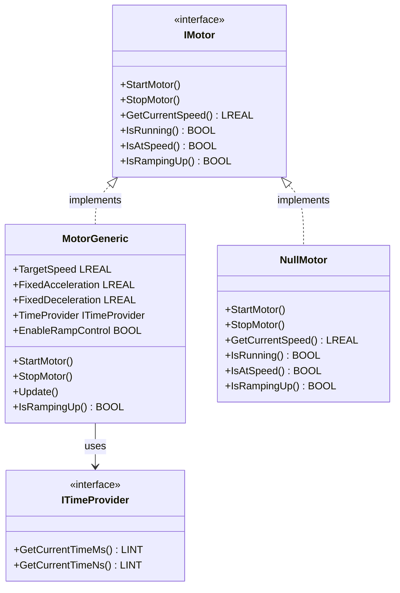

# Motor System Documentation

## Overview

The Motor system provides a flexible and extensible motor control framework for conveyor systems. It implements a clean interface-based architecture that allows different motor implementations to be used interchangeably.

## Architecture



## Components

### IMotor Interface

The [`IMotor`](../src/Motor/IMotor.st) interface defines the contract for all motor implementations.

#### Methods

##### `StartMotor(targetSpeed, acceleration)`
Starts the motor with specified speed and acceleration parameters.

**Parameters:**
- `targetSpeed` (LREAL) - Target speed in m/s (limited by MaxSpeed)
- `acceleration` (LREAL) - Acceleration rate in m/s² (limited by MaxAcceleration)

**Returns:** None

**Usage:**
```st
motor.StartMotor(targetSpeed := 1.5, acceleration := 0.5);
```

##### `StopMotor(deceleration)`
Stops the motor with specified deceleration.

**Parameters:**
- `deceleration` (LREAL) - Deceleration rate in m/s² (limited by MaxDeceleration)

**Returns:** None

**Usage:**
```st
motor.StopMotor(deceleration := 1.0);
```

##### `GetCurrentSpeed() : LREAL`
Returns the current speed of the motor.

**Parameters:** None

**Returns:** Current speed in m/s

**Usage:**
```st
currentSpeed := motor.GetCurrentSpeed();
```

##### `IsRunning() : BOOL`
Checks if the motor is currently running.

**Parameters:** None

**Returns:** 
- `TRUE` - Motor is running (speed > 0)
- `FALSE` - Motor is stopped

**Usage:**
```st
IF motor.IsRunning() THEN
    // Motor is active
END_IF;
```

##### `IsAtSpeed() : BOOL`
Checks if the motor has reached the target speed.

**Parameters:** None

**Returns:**
- `TRUE` - Motor is at target speed
- `FALSE` - Motor is still accelerating/decelerating

**Usage:**
```st
IF motor.IsAtSpeed() THEN
    // Motor has reached target speed
END_IF;
```

##### `IsRampingUp() : BOOL`
Checks if the motor is currently ramping up to target speed.

**Parameters:** None

**Returns:**
- `TRUE` - Motor is actively accelerating
- `FALSE` - Motor is not ramping up (stopped, at speed, or decelerating)

**Usage:**
```st
IF motor.IsRampingUp() THEN
    // Motor is accelerating
END_IF;
```

---

### MotorGeneric Class

The [`MotorGeneric`](../src/Motor/MotorGeneric.st) class provides generic motor control with configurable ramp-up and ramp-down behavior.

#### Properties

| Property | Type | Default | Description |
|----------|------|---------|-------------|
| `MaxSpeed` | LREAL | 2.0 | Maximum allowed speed in m/s |
| `MaxAcceleration` | LREAL | 2.0 | Maximum allowed acceleration in m/s² |
| `MaxDeceleration` | LREAL | 2.0 | Maximum allowed deceleration in m/s² |
| `MotorOutput` | IBinOutput | NULL | Binary output for motor on/off signal control |
| `ExternalRelease` | IRelease | NULL | External release control (NULL = always released) |

#### Constants

| Constant | Value | Description |
|----------|-------|-------------|
| `MAX_SPEED` | 10.0 m/s | Maximum allowed speed |
| `MAX_ACCELERATION` | 2.0 m/s² | Maximum allowed acceleration |
| `MAX_DECELERATION` | 2.0 m/s² | Maximum allowed deceleration |
| `SPEED_TOLERANCE` | 0.01 m/s | Tolerance for speed comparison |

#### Methods

##### `StartMotor(targetSpeed, acceleration)`
Starts the motor with specified parameters. Validates configuration before starting.

**Parameters:**
- `targetSpeed` (LREAL) - Target speed in m/s (limited by MaxSpeed)
- `acceleration` (LREAL) - Acceleration rate in m/s² (limited by MaxAcceleration)

**Behavior:**
- Automatically sets `MotorOutput.SetOn()` if output is configured
- Respects `ExternalRelease` - motor only starts if released
- Uses OnDelay timer for acceleration ramp

**Validation:**
- `targetSpeed` is limited to `MaxSpeed`
- `acceleration` is limited to `MaxAcceleration`
- Configuration must be valid before starting

##### `StopMotor(deceleration)`
Stops the motor with specified deceleration.

**Parameters:**
- `deceleration` (LREAL) - Deceleration rate in m/s² (limited by MaxDeceleration)

**Behavior:**
- Automatically sets `MotorOutput.SetOff()` if output is configured
- Uses OffDelay timer for deceleration ramp

##### `Update()`
**Must be called cyclically** to update motor timers and control logic.

**Requirements:**
- Should be called in every PLC cycle for proper operation

**Behavior:**
- Updates OnDelay and OffDelay timers
- Manages motor output state based on release conditions
- Handles acceleration and deceleration timing

##### `IsRampingUp() : BOOL`
Returns whether the motor is currently ramping up.

**Returns:**
- `TRUE` - Motor is accelerating to target speed
- `FALSE` - Motor is not ramping up

##### `ValidateConfiguration() : BOOL` (Protected)
Internal method to validate motor configuration.

**Returns:**
- `TRUE` - Configuration is valid
- `FALSE` - Configuration is invalid

#### Example Usage

```st
USING Simatic.Ax.Motor;
USING Simatic.Ax.IO.Output;

VAR
    motor : MotorGeneric;
    motorOutput : IBinOutput;
    release : IRelease;
END_VAR

// Configuration
motor.MaxSpeed := 2.0;                 // 2.0 m/s maximum
motor.MaxAcceleration := 1.0;          // 1.0 m/s² maximum
motor.MaxDeceleration := 1.5;          // 1.5 m/s² maximum
motor.MotorOutput := motorOutput;      // Physical output
motor.ExternalRelease := release;      // Optional release control

// Start motor with specific parameters
motor.StartMotor(targetSpeed := 1.5, acceleration := 0.5);

// Cyclic update (must be called every cycle!)
motor.Update();

// Check status
IF motor.IsAtSpeed() THEN
    // Motor has reached target speed
END_IF;

// Stop motor with specific deceleration
motor.StopMotor(deceleration := 1.0);
```

---

### NullMotor Class

The [`NullMotor`](../src/Motor/NullMotor.st) implements the Null Object Pattern for [`IMotor`](../src/Motor/IMotor.st). It provides a "do-nothing" motor implementation that can be used when no real motor is configured.

#### Purpose

- Eliminates the need for NULL checks in conveyor code
- Allows [`ConveyorBase`](../src/Conveyor/ConveyorBase.st) to work without a motor instance
- Provides safe default behavior

#### Behavior

| Method | Behavior |
|--------|----------|
| `StartMotor()` | Does nothing |
| `StopMotor()` | Does nothing |
| `GetCurrentSpeed()` | Always returns `0.0` |
| `IsRunning()` | Always returns `FALSE` |
| `IsAtSpeed()` | Always returns `FALSE` |
| `IsRampingUp()` | Always returns `FALSE` |

#### Example Usage

```st
VAR
    conveyor : ConveyorBase;
    nullMotor : NullMotor;
END_VAR

// Use NullMotor when no real motor is needed
conveyor.Motor := nullMotor;

// Or let ConveyorBase automatically use NullMotor
// if Motor property is not set (NULL)
conveyor.Motor := NULL;  // ConveyorBase will use internal NullMotor
```

---

## Integration with Conveyor

The motor system integrates seamlessly with [`ConveyorBase`](../src/Conveyor/ConveyorBase.st) through dependency injection:

```st
VAR
    conveyor : ConveyorBase;
    motor : MotorGeneric;
    motorOutput : IBinOutput;
    release : IRelease;
END_VAR

// Configure motor
motor.MaxSpeed := 2.0;
motor.MaxAcceleration := 1.0;
motor.MaxDeceleration := 1.5;
motor.MotorOutput := motorOutput;
motor.ExternalRelease := release;

// Inject motor into conveyor
conveyor.Motor := motor;
conveyor.AutomaticSpeed := 1.5;
conveyor.ManualSpeed := 0.5;
conveyor.Acceleration := 1.0;
conveyor.Deceleration := 1.5;

// Conveyor will automatically control motor with configured speeds
conveyor.RunCyclic();

// Update motor (must be called cyclically)
motor.Update();
```

---

## Best Practices

### 1. Configure Motor Limits
```st
// ✓ Good
motor.MaxSpeed := 2.0;
motor.MaxAcceleration := 1.0;
motor.MaxDeceleration := 1.5;
motor.StartMotor(targetSpeed := 1.5, acceleration := 0.5);

// ✗ Bad - using defaults without verification
motor.StartMotor(targetSpeed := 5.0, acceleration := 10.0);  // Will be limited!
```

### 2. Call Update() Cyclically
```st
// ✓ Good - in cyclic task
motor.Update();

// ✗ Bad - update only called once
IF firstScan THEN
    motor.Update();
END_IF;
```

### 3. Use ExternalRelease for Safety
```st
// ✓ Good - motor respects release control
motor.ExternalRelease := safetyRelease;
motor.StartMotor(targetSpeed := 1.5, acceleration := 0.5);

// ✓ Good - motor always released (backward compatibility)
motor.ExternalRelease := NULL;
motor.StartMotor(targetSpeed := 1.5, acceleration := 0.5);
```

### 4. Use Null Object Pattern
```st
// ✓ Good - no NULL checks needed
conveyor.Motor := nullMotor;
conveyor.Motor.StartMotor();  // Safe

// ✗ Bad - requires NULL checks everywhere
IF conveyor.Motor <> NULL THEN
    conveyor.Motor.StartMotor();
END_IF;
```

---

## Testing

The motor system includes comprehensive tests:

- **Basic Tests**: [`MotorGenericBasicTest`](../test/MotorGeneric/Basic/MotorAsyncBasicTest.st)
- **Integration Tests**: [`MotorGenericIntegrationTest`](../test/MotorGeneric/Integration/MotorAsyncIntegrationTest.st)
- **Interruption Tests**: [`MotorGenericInterruptionTest`](../test/MotorGeneric/Interruption/MotorAsyncInterruptionTest.st)
- **Validation Tests**: [`MotorGenericValidationTest`](../test/MotorGeneric/Validation/MotorAsyncValidationTest.st)
- **Ramp Precision Tests**: [`MotorGenericRampPrecisionTest`](../test/MotorGeneric/RampPrecision/MotorAsyncRampPrecisionTest.st)

---

## See Also

- [TimeProvider Documentation](TimeProvider.md)
- [Conveyor Documentation](Conveyor.md)
- [Main README](../README.md)
