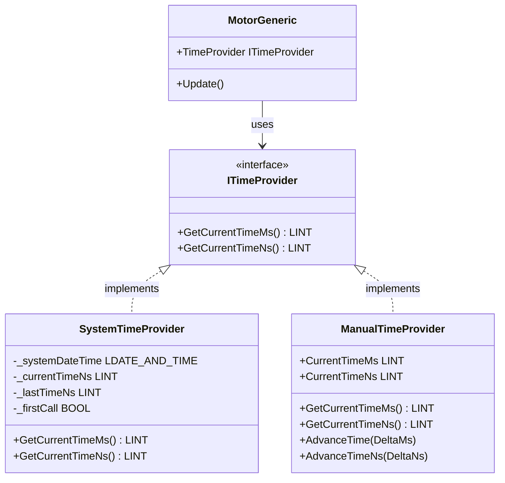

# TimeProvider System Documentation

## Overview

The TimeProvider system provides a flexible abstraction for time measurement in motor control applications. It enables precise timing for motor ramp-up and ramp-down calculations while supporting both real-time and simulated time sources.

## Architecture



## Components

### ITimeProvider Interface

The [`ITimeProvider`](../src/Motor/TimeProvider/ITimeProvider.st) interface defines the contract for all time provider implementations.

#### Methods

##### `GetCurrentTimeMs() : LINT`
Returns the delta time in milliseconds since the last call.

**Parameters:** None

**Returns:** Delta time in milliseconds (ms)

**Behavior:**
- First call: Returns `0` (initialization)
- Subsequent calls: Returns elapsed time since last call

**Usage:**
```st
deltaMs := timeProvider.GetCurrentTimeMs();
```

##### `GetCurrentTimeNs() : LINT`
Returns the delta time in nanoseconds since the last call.

**Parameters:** None

**Returns:** Delta time in nanoseconds (ns)

**Precision:** 1 nanosecond = 0.000001 milliseconds

**Behavior:**
- First call: Returns `0` (initialization)
- Subsequent calls: Returns elapsed time since last call

**Usage:**
```st
deltaNs := timeProvider.GetCurrentTimeNs();
```

---

### SystemTimeProvider Class

The [`SystemTimeProvider`](../src/Motor/TimeProvider/SystemTimeProvider.st) provides real-time measurements using the PLC system clock.

#### Features

- Uses `Siemens.Simatic.Clocks.GetSystemDateTime()` for accurate time
- Calculates delta time between consecutive calls
- Supports both millisecond and nanosecond precision
- Thread-safe for single-instance use

#### Internal State

| Variable | Type | Description |
|----------|------|-------------|
| `_systemDateTime` | LDATE_AND_TIME | Current system date/time |
| `_currentTimeNs` | LINT | Current time in nanoseconds |
| `_lastTimeNs` | LINT | Last recorded time in nanoseconds |
| `_firstCall` | BOOL | Flag for initialization |

#### Methods

##### `GetCurrentTimeMs() : LINT`
Returns delta time in milliseconds since last call.

**Algorithm:**
1. Get current system time via `GetSystemDateTime()`
2. Convert to nanoseconds
3. Calculate delta: `currentTime - lastTime`
4. Convert to milliseconds: `deltaNs / 1,000,000`
5. Update `lastTime` for next call

**First Call Behavior:**
- Returns `0`
- Initializes `_lastTimeNs`
- Sets `_firstCall` to `FALSE`

**Example:**
```st
VAR
    timeProvider : SystemTimeProvider;
    deltaMs : LINT;
END_VAR

// First call - initialization
deltaMs := timeProvider.GetCurrentTimeMs();  // Returns 0

// Wait some time...

// Second call - returns actual elapsed time
deltaMs := timeProvider.GetCurrentTimeMs();  // Returns e.g., 100 (ms)
```

##### `GetCurrentTimeNs() : LINT`
Returns delta time in nanoseconds since last call.

**Precision:** Nanosecond accuracy (1 ns = 10⁻⁹ seconds)

**Example:**
```st
VAR
    timeProvider : SystemTimeProvider;
    deltaNs : LINT;
END_VAR

// First call
deltaNs := timeProvider.GetCurrentTimeNs();  // Returns 0

// Second call
deltaNs := timeProvider.GetCurrentTimeNs();  // Returns e.g., 100000000 (100ms in ns)
```

#### Usage Example

```st
USING Simatic.Ax.Motor;

VAR
    motor : MotorGeneric;
    timeProvider : SystemTimeProvider;
END_VAR

// Configure motor with system time provider
motor.TimeProvider := timeProvider;
motor.TargetSpeed := 1.5;
motor.FixedAcceleration := 0.5;

// Start motor
motor.StartMotor();

// Cyclic update - motor uses timeProvider internally
motor.Update();
```

---

### ManualTimeProvider Class

The [`ManualTimeProvider`](../src/Motor/TimeProvider/ManualTimeProvider.st) provides manual time control for testing and simulation.

#### Features

- Full control over time progression
- Deterministic behavior for unit tests
- No dependency on system clock
- Supports both millisecond and nanosecond precision

#### Properties

| Property | Type | Access | Description |
|----------|------|--------|-------------|
| `CurrentTimeMs` | LINT | PUBLIC | Current time in milliseconds |
| `CurrentTimeNs` | LINT | PUBLIC | Current time in nanoseconds |

#### Methods

##### `GetCurrentTimeMs() : LINT`
Returns the manually set current time in milliseconds.

**Returns:** Value of `CurrentTimeMs`

**Example:**
```st
timeProvider.CurrentTimeMs := LINT#1000;
time := timeProvider.GetCurrentTimeMs();  // Returns 1000
```

##### `GetCurrentTimeNs() : LINT`
Returns the manually set current time in nanoseconds.

**Returns:** Value of `CurrentTimeNs`

**Example:**
```st
timeProvider.CurrentTimeNs := LINT#1000000000;
time := timeProvider.GetCurrentTimeNs();  // Returns 1000000000
```

##### `AdvanceTime(DeltaMs : LINT)`
Advances the time by specified milliseconds.

**Parameters:**
- `DeltaMs` - Time to advance in milliseconds

**Behavior:**
- Updates `CurrentTimeMs` by adding `DeltaMs`
- Updates `CurrentTimeNs` by adding `DeltaMs * 1,000,000`

**Example:**
```st
timeProvider.AdvanceTime(DeltaMs := LINT#100);  // Advance by 100ms
```

##### `AdvanceTimeNs(DeltaNs : LINT)`
Advances the time by specified nanoseconds.

**Parameters:**
- `DeltaNs` - Time to advance in nanoseconds

**Behavior:**
- Updates `CurrentTimeNs` by adding `DeltaNs`
- Updates `CurrentTimeMs` by adding `DeltaNs / 1,000,000`

**Example:**
```st
timeProvider.AdvanceTimeNs(DeltaNs := LINT#50000000);  // Advance by 50ms
```

#### Testing Example

```st
USING Simatic.Ax.Motor;
USING AxUnit.Assert;

{Test}
METHOD PUBLIC Test_MotorRampUp
    VAR
        motor : MotorGeneric;
        timeProvider : ManualTimeProvider;
        speed : LREAL;
    END_VAR
    
    // Arrange
    motor.TimeProvider := timeProvider;
    motor.TargetSpeed := 1.0;
    motor.FixedAcceleration := 1.0;  // 1 m/s²
    
    // Act - Start motor
    motor.StartMotor();
    motor.Update();  // Initialize
    
    // Simulate 0.5 seconds
    timeProvider.AdvanceTime(DeltaMs := LINT#500);
    motor.Update();
    
    // Assert - After 0.5s with 1 m/s² acceleration: speed = 0.5 m/s
    speed := motor.GetCurrentSpeed();
    Equal(expected := 0.5, actual := speed);
END_METHOD
```

#### Simulation Example

```st
VAR
    motor : MotorGeneric;
    timeProvider : ManualTimeProvider;
    simulationStep : LINT := LINT#10;  // 10ms steps
END_VAR

// Configure
motor.TimeProvider := timeProvider;
motor.TargetSpeed := 2.0;
motor.FixedAcceleration := 0.5;
motor.StartMotor();

// Simulation loop
FOR i := 1 TO 100 DO
    timeProvider.AdvanceTime(DeltaMs := simulationStep);
    motor.Update();
    
    // Log current speed
    currentSpeed := motor.GetCurrentSpeed();
END_FOR;
```

---

## Time Conversion Reference

### Milliseconds ↔ Nanoseconds

| Milliseconds (ms) | Nanoseconds (ns) | Conversion |
|-------------------|------------------|------------|
| 1 ms | 1,000,000 ns | × 1,000,000 |
| 10 ms | 10,000,000 ns | × 1,000,000 |
| 100 ms | 100,000,000 ns | × 1,000,000 |
| 1000 ms (1s) | 1,000,000,000 ns | × 1,000,000 |

**Formula:**
```
nanoseconds = milliseconds × 1,000,000
milliseconds = nanoseconds ÷ 1,000,000
```

---

## Choosing the Right TimeProvider

### Use SystemTimeProvider When:

✓ Running on real PLC hardware  
✓ Need actual elapsed time measurements  
✓ Production environment  
✓ Real-time motor control  

**Example:**
```st
VAR
    motor : MotorGeneric;
    timeProvider : SystemTimeProvider;
END_VAR

motor.TimeProvider := timeProvider;
```

### Use ManualTimeProvider When:

✓ Writing unit tests  
✓ Simulating time progression  
✓ Deterministic behavior required  
✓ Testing edge cases  
✓ Debugging timing issues  

**Example:**
```st
VAR
    motor : MotorGeneric;
    timeProvider : ManualTimeProvider;
END_VAR

motor.TimeProvider := timeProvider;
timeProvider.AdvanceTime(DeltaMs := LINT#100);
```

---

## Best Practices

### 1. Always Initialize TimeProvider

```st
// ✓ Good
motor.TimeProvider := timeProvider;
motor.StartMotor();

// ✗ Bad - motor won't work
motor.StartMotor();  // TimeProvider is NULL!
```

### 2. Use Consistent Time Units

```st
// ✓ Good - consistent milliseconds
timeProvider.AdvanceTime(DeltaMs := LINT#100);
deltaMs := timeProvider.GetCurrentTimeMs();

// ✓ Good - consistent nanoseconds
timeProvider.AdvanceTimeNs(DeltaNs := LINT#100000000);
deltaNs := timeProvider.GetCurrentTimeNs();

// ⚠ Mixed - be aware of conversions
timeProvider.AdvanceTime(DeltaMs := LINT#100);  // Also updates nanoseconds
deltaNs := timeProvider.GetCurrentTimeNs();     // Returns 100,000,000
```

### 3. Handle First Call Correctly

```st
// ✓ Good - expect 0 on first call
deltaMs := timeProvider.GetCurrentTimeMs();  // Returns 0
IF deltaMs > LINT#0 THEN
    // Process elapsed time
END_IF;

// ✗ Bad - assuming non-zero on first call
deltaMs := timeProvider.GetCurrentTimeMs();
speedChange := acceleration * TO_LREAL(deltaMs);  // Wrong on first call!
```

### 4. Test with ManualTimeProvider

```st
// ✓ Good - deterministic test
{Test}
METHOD PUBLIC Test_MotorBehavior
    VAR
        motor : MotorGeneric;
        manualTime : ManualTimeProvider;
    END_VAR
    
    motor.TimeProvider := manualTime;
    motor.StartMotor();
    
    manualTime.AdvanceTime(DeltaMs := LINT#1000);
    motor.Update();
    
    // Predictable result
    Equal(expected := expectedSpeed, actual := motor.GetCurrentSpeed());
END_METHOD
```

---

## Testing

The TimeProvider system includes comprehensive tests:

- **TimeProvider Tests**: [`TimeProviderTest`](../test/TimeProvider/TimeProviderTest.st)
  - `ManualTimeProviderTest` - Tests for manual time control
  - `SystemTimeProviderTest` - Tests for system time provider with mocking

### Test Coverage

#### ManualTimeProvider Tests
- Initial state (zero time)
- Time advancement (milliseconds)
- Time advancement (nanoseconds)
- Multiple time advances (accumulation)
- Mixed millisecond/nanosecond operations
- Real-world timing scenarios

#### SystemTimeProvider Tests
- Delta time calculation (milliseconds)
- Delta time calculation (nanoseconds)
- Multiple consecutive calls
- Consistency between ms and ns methods
- Mocked time progression

---

## Integration with MotorGeneric

The [`MotorGeneric`](../src/Motor/MotorGeneric.st) class uses [`ITimeProvider`](../src/Motor/TimeProvider/ITimeProvider.st) for precise ramp calculations:

```st
METHOD PUBLIC Update
    VAR_TEMP
        currentTimeNs : LINT;
        deltaTimeNs : LINT;
        deltaTimeSeconds : LREAL;
        speedChange : LREAL;
    END_VAR
    
    // Get delta time in nanoseconds for precision
    currentTimeNs := TimeProvider.GetCurrentTimeNs();
    
    // Calculate elapsed time
    deltaTimeNs := currentTimeNs - _lastUpdateTimeNs;
    deltaTimeSeconds := TO_LREAL(deltaTimeNs) / 1000000000.0;
    
    // Calculate speed change
    speedChange := FixedAcceleration * deltaTimeSeconds;
    _currentSpeed := _currentSpeed + speedChange;
END_METHOD
```

---

## Performance Considerations

### SystemTimeProvider
- **Overhead:** Low (single system call per measurement)
- **Precision:** Nanosecond (hardware dependent)
- **Latency:** Minimal (< 1ms typical)

### ManualTimeProvider
- **Overhead:** Negligible (simple variable access)
- **Precision:** Exact (no rounding errors)
- **Latency:** None (immediate)

---

## See Also

- [Motor Documentation](Motor.md)
- [Conveyor Documentation](Conveyor.md)
- [Main README](../README.md)
